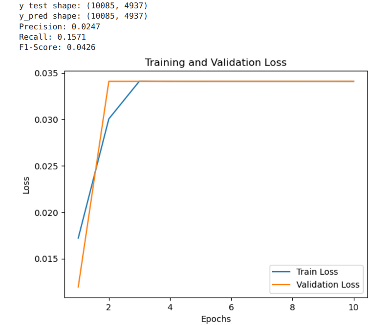
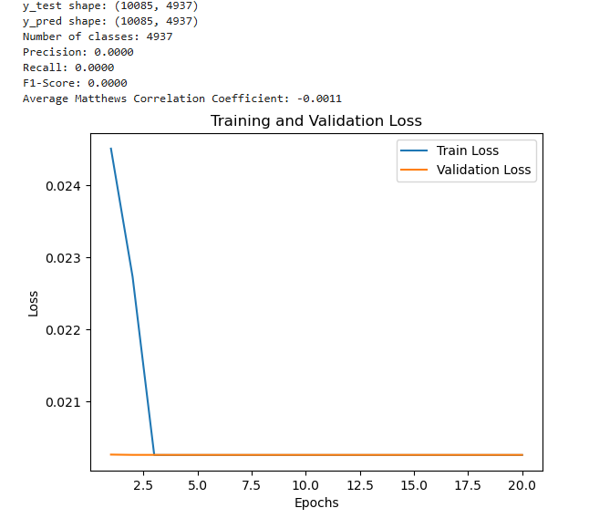

# Report for week 3 - Embedding using Convolutional Layers with Sigmoid activation function
Authors:

Anna Beketova

Shatu Ahmed

## Introduction
Previous approach:

<ul>
    <li> CNN model with 4 convolutional layers
    <li> Linear activation function
    <li> Result: MCC = 0.5
</ul>

New approach: CNN with Sigmoid activation function on the output layer

## Methods

### Implementing Multi-Label classification

Sigmoid activation function requires multi-label classification. The labeling was changed from multi-class to multi label with multi-hot encoding using `MultiLabelBinarizer` library. Each column corresponds to a class, and each row represents a sample. If a sample belongs to a label, the corresponding column is 1 (otherwise 0). 

 Due to the fact, that some protein sequences can have multiple bins, switching to multi-label classification could improve the quality of prediction, because information loss, possibly occured with multi-class classification, could be reduced. 

### Sigmoid with BCELoss()

Sigmoid activation function was applied on the output layer. Loss function was changed from Cross Entropy to Binary Cross Entropy `BCELoss()`. As an optimizer Adam with Learning Rates = 0.01 and 0.001 was used. 

### Sigmoid with BCEWithLogitsLoss()

`BCEWithLogitsLoss()` is more stable than `BCELoss`, so a different model using this function was implemented to compare the results. 

### Sequence length

The first idea was to perform training using 752 (90%-Quantile) aminoacid long sequences, but later we noticed that this length results in very long training time, so the methods above used `409` aminoacid length instead.

### Review and validation of the output predictions as probabilities

To turn the outputs of the model into probabilities, the correct approach was already taken by including the Sigmoid activation layer. `(self.sigmoid = nn.Sigmoid())` . This would convert the raw logits from the final linear layer (fc) into probabilities for each output node. Nevertheless, the raw outputs were examined after the training process and verified.

Another approach using the Softmax activation layer for multi-class problems was implemented, but did not produce any results and was abandoned again.
## Results

### Results of Sigmoid with BCELoss()

The prediction threshold was changed from 0.5 to 0.2. Results:

### Results of Sigmoid with BCEWithLogitsLoss()

Same results as of BCELoss(), but the training loss starts with 0.6934, slightly decreases after 2nd iteration to 0.6932 and doesn't change anymore.

## Discussion & Next Steps

The model seems not to be training sufficiently, as the training loss is not changing after the 2nd iteration.

The output were verified to be probabilities within the range of 0 to 1. Switching to a multiclass activation layer, like Softmax did not seem to agree with the model and could not produce an output at all.

Output: 
Predicted Probabilities: tensor([[0., 0., 0.,  ..., 0., 0., 0.],
        [0., 0., 0.,  ..., 0., 0., 0.],
        [0., 0., 0.,  ..., 0., 0., 0.],
        [0., 0., 0.,  ..., 0., 0., 0.],
        [0., 0., 0.,  ..., 0., 0., 0.]], grad_fn=<SigmoidBackward0>)

Possible next steps: 
<ul>
    <li> Try different activation function
    <li> Handle class imbalance
    <li> Try updated kidera encoding
    <li> Perform training with longer sequences
    <li> Sequence dataset might need to reexamined
</ul>

