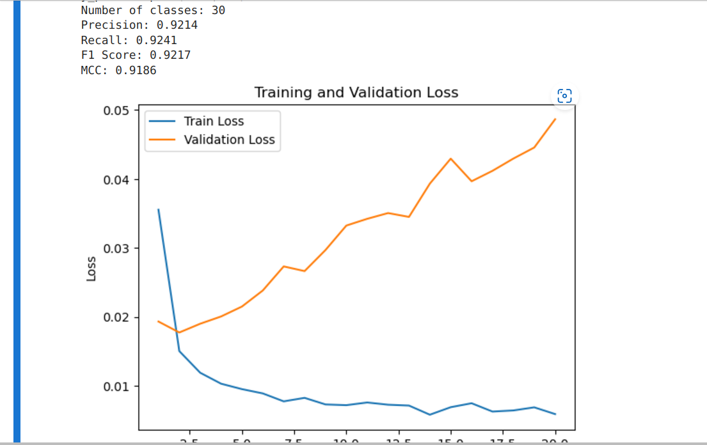
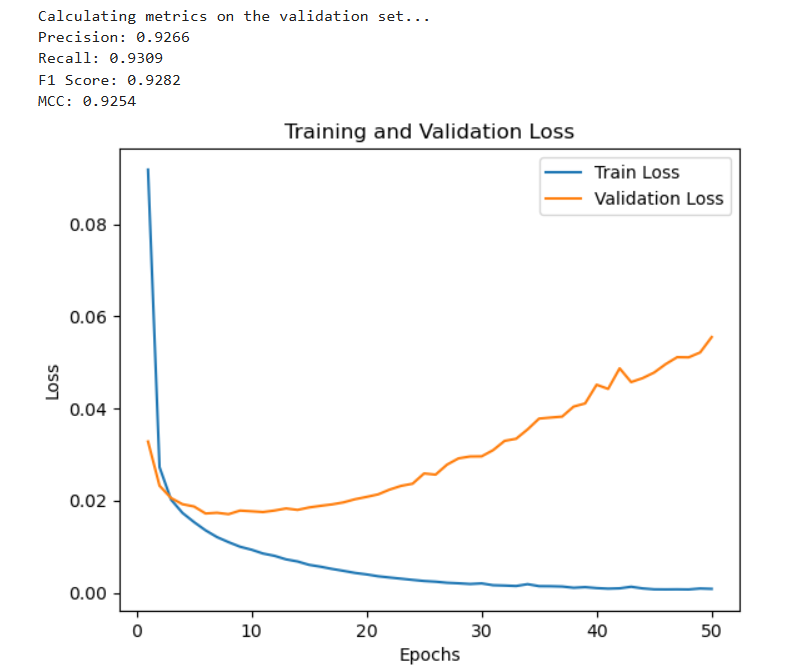
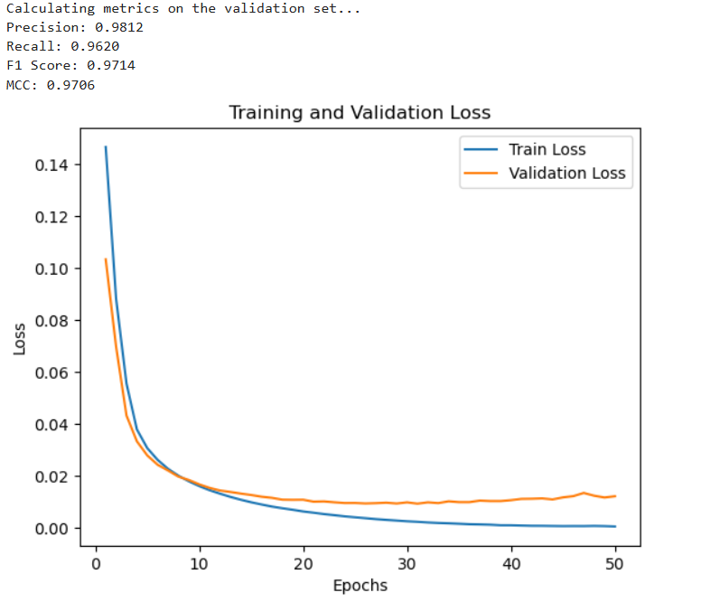

# Report for week 4 - Embedding using Convolutional Layers with Sigmoid activation function (new dataset)
Authors:

- Anna Beketova

- Shatu Ahmed

## Introduction
Previous approach:

<ul>
    <li> CNN with Sigmoid activation function on the output layer
    <li> Random data splitting via PyTorch
    <li> Metrics from sklearn
    <li> Dataset with large class imbalance (over 4000 classes with lots of class minorities)   
    <li> Result: Negative MCC, Insufficient training, training loss did not change after the 2nd iteration
    <li> unbalanced data splitting  
</ul>

To Do:
Investgiate the efficiency of the model with new provided dataset and using the PyTorch library for different metrics. 

In the new dataset larger bins were used so that there were only 30 classes and therefore more balanced data (although the bins are still not equal in size).

## Methods

### New metrics

**torchmetrics** is designed to work with PyTorch tensors and models, making it more efficient and straightforward when working with the GPU. It handles metric updates for each batch and would compute validation and test sets automatically.

One aspect that had to be paid attention to was the function `torch.bincount`. It expects integer inputs, so the the variables `predictions` and `batch_labels` had to be converted into Integers as they were of the type float. This is because multi-label confusion matrix metrics require binary values (0 or 1) as integer types (torch.int), not floating-point probabilities.

## Results

### Results with sequences length of 822 aminoacids and lr=0.001:

From the results we can see that approximately 20 epoches are enough for the model to train, after that validation loss is growing which suggests overfitting.

### learning rate = 0.0001:

Although validation loss grows as well, MCC score is slightly higher, suggesting a little bit more sufficient learning.

### Adding MaxPooling:

MCC score is at it's highest in comparison to the other models and validation loss decreased significantly.
Pooling would reduce the sequence length and help with feature selection while also reducing computation time.

## Discussion & Next Steps

The model seems to be training more sufficiently in comparison to the previous approach. Training loss stops after 20 iterations of training and validation loss also decreases, especially when using pooling technique. The high MCC score and other metrics suggest a precise model. 
The model was also significantly faster than previous approaches even with longer sequences. The updated training data also seemed much more agreeable with our model.

Possible next steps: 
<ul>
    <li> Ensure that stratified split is done correctly and compare the results with the model with random data split
    <li> Perform training with even longer sequences
    <li> Trying different weights to reduce class imbalance so much as possible
    <li> Trying SGD optimizer instead of adam to compare the performance and results
</ul>

