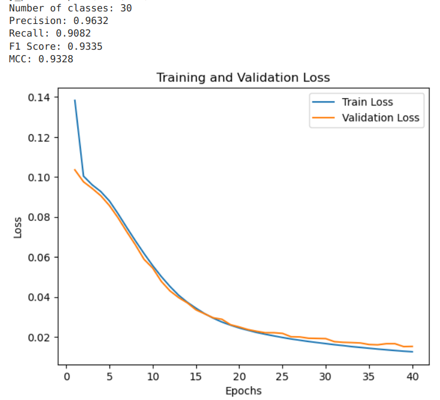
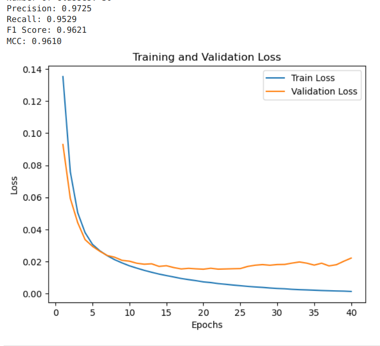
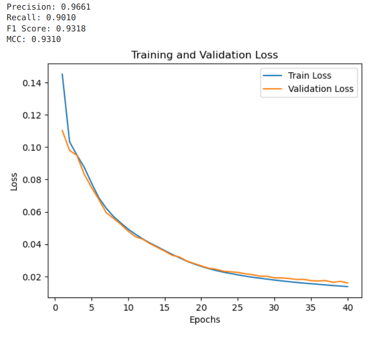
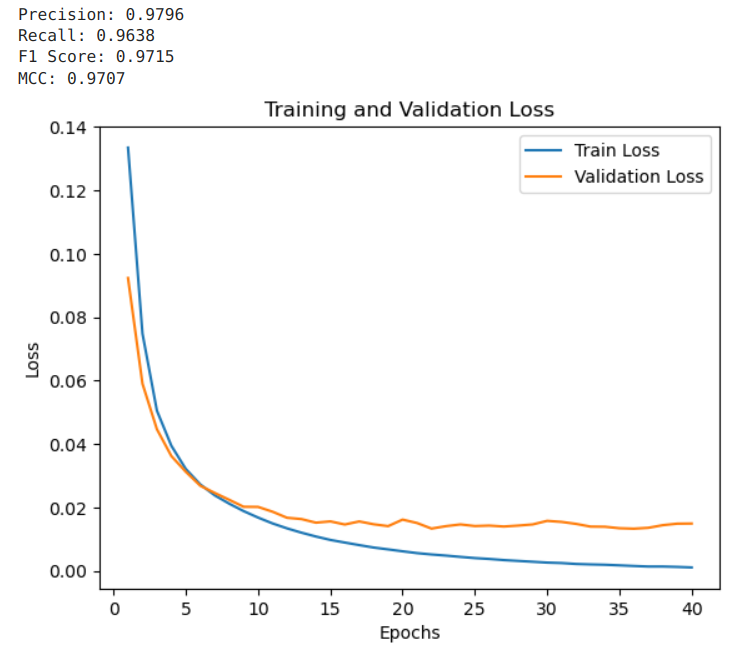

# Report for week 5 - Embedding using Convolutional Layers with Sigmoid activation function
Authors:

- Anna Beketova

- Shatu Ahmed

## Introduction
Previous week:

<ul>
    <li>  CNN with Sigmoid activation function on the output layer
    <li> high MCC score --> precise model
    <li> Models performed significantly faster than previous approaches
    <li> updated training data much more agreeable   
</ul>

To Do:
- Try longer sequences
- Incorporate sgd optimizer
- provide more statistical information 

## Methods
Little to no changes were made to the CNN Model code itself
Various learning rates and sequence lengths were experimented with to evaluate the model's performance and efficiency. Additionally, the Adam optimizer and the SGD optimizer were compared to assess their relative effectiveness.

## Results

Due to extensive number of experiments conducted, only the most significant results are presented here. For a full overview of all experiments, please refer to the our [Labbook.](https://gitlab.rlp.net/aibi_practical/aibi-ws-2024-25/-/blob/Embedding/week5/Labbook_week5.ipynb?ref_type=heads)

### Statistics for the protein sequence lengths:

- Average Length: 479.29457595156566
- Median Length: 447.0
- Maximum Length: 4904
- Minimum Length: 72

### length 1500, SGD, 40 epochs, batch size 64, max pooling, lr=0.1, weight_decay=1e-4

### 3500 length, max pooling, batch size 64, lr = 0.0001, 40 epochs, adam optimizer:

### length 3500, SGD, 40 epochs, batch size 64, max pooling, lr=0.1, weight_decay=1e-4

A bit more precise but so far adam has the higher MCC.

### 4500 length, max pooling, batch size 64, lr = 0.0001, 40 epochs, adam optimizer

Higher MCC score than approaches with sgd.

## Discussion & Next Steps

Overall, the model remains precise, as evidenced by its high MCC score. The SGD optimizer did not produce better results, making the Adam optimizer the favorable choice. The model performed well with a sequence length of 4900 (our maximum length). Thus, it demonstrates a strong performance, and previous faults and low scores can be attributed to issues with the training set.

Possible next steps: 
<ul>
    <li> Keep experimenting with adam optimizer to try to reduce overfitting as much as possible.
</ul>

