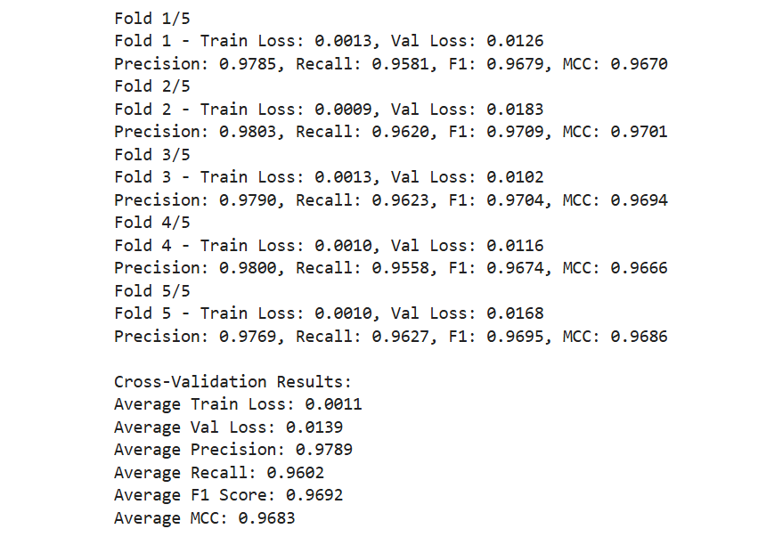

Common information:

- Updated dataset (30 classes)
- Sigmoid activation function
- 4 convolutional layers
- BCELoss() loss function
- Batch size: 64

Abbreviations:

- MCC - Matthew's Correlation Coefficient
- DL 1-4 - Dropout Layers value after the 1st-4th convolutional layers
- DL fc - Dropout Layer value before a fully connected layer

Sequence length 822:

|Epoch size|Optimizer|Max pooling|Learning rate|Weight decay|Precision|Recall|F1-score|MCC   |
|---------:|--------:|----------:|------------:|-----------:|--------:|-----:|-------:|-----:|
|        50|     Adam|        Yes|       0.0001|        None|   0.9812|0.9620|  0.9714|0.9706|
|        20|     Adam|       None|       0.0001|        None|   0.9266|0.9309|  0.9282|0.9254|
|        20|     Adam|       None|        0.001|        None|   0.9214|0.9241|  0.9217|0.9186|

Sequence length 1500:

|Epoch size|Optimizer|Max pooling|Learning rate|Weight decay|DL 1|DL 2|DL 3|DL 4|DL fc|Precision|Recall|F1-score|   MCC|
|---------:|--------:|----------:|------------:|-----------:|---:|---:|---:|---:|----:|--------:|-----:|-------:|-----:|
|        40|     Adam|        Yes|       0.0001|        None|None|None|None|None| None|   0.9806|0.9623|  0.9712|0.9704|
|        40|     Adam|        Yes|       0.0001|        1e-4|None|None|None|None| None|   0.9782|0.9534|  0.9655|0.9645|
|        40|      SGD|        Yes|          0.1|        1e-4|None|None|None|None| None|   0.9632|0.9082|  0.9335|0.9328|
|        40|      SGD|        Yes|         0.01|        1e-4|None|None|None|None| None|   0.4763|0.1764|  0.2287|0.3488|
|        40|     Adam|        Yes|       0.0001|        1e-4| 0.2| 0.2| 0.2| 0.2|  0.5|   0.9825|0.9369|  0.9585|0.9581|
|        40|     Adam|        Yes|       0.0001|        1e-4|None|None| 0.2| 0.2|  0.5|   0.9848|0.9406|  0.9619|0.9612|

Sequence length 2500:

|Epoch size|Optimizer|Max pooling|Learning rate|Weight decay|Precision|Recall|F1-score|MCC   |
|---------:|--------:|----------:|------------:|-----------:|--------:|-----:|-------:|-----:|
|        40|     Adam|        Yes|       0.0001|        None|   0.9800|0.9578|  0.9687|0.9678|
|        40|     Adam|        Yes|       0.0001|        1e-4|   0.9720|0.9503|  0.9607|0.9597|
|        40|      SGD|        Yes|          0.1|        1e-4|   0.9691|0.9026|  0.9338|0.9334|

Sequence length 3500:

|Epoch size|Optimizer|Max pooling|Learning rate|Weight decay|Precision|Recall|F1-score|MCC   |
|---------:|--------:|----------:|------------:|-----------:|--------:|-----:|-------:|-----:|
|        40|     Adam|        Yes|       0.0001|        None|   0.9725|0.9529|  0.9621|0.9610|
|        40|     Adam|        Yes|       0.0001|        1e-4|   0.9739|0.9444|  0.9586|0.9575|
|        40|      SGD|        Yes|          0.1|        1e-4|   0.9661|0.9010|  0.9318|0.9310|
|        40|     Adam|        Yes|      0.00001|        None|   0.9128|0.7698|  0.8300|0.8399|

Sequence length 4500:

|Epoch size|Optimizer|Max pooling|Learning rate|Weight decay|Precision|Recall|F1-score|MCC   |
|---------:|--------:|----------:|------------:|-----------:|--------:|-----:|-------:|-----:|
|        40|     Adam|        Yes|       0.0001|        None|   0.9796|0.9638|  0.9715|0.9707|

## Results of Cross-Validation:

