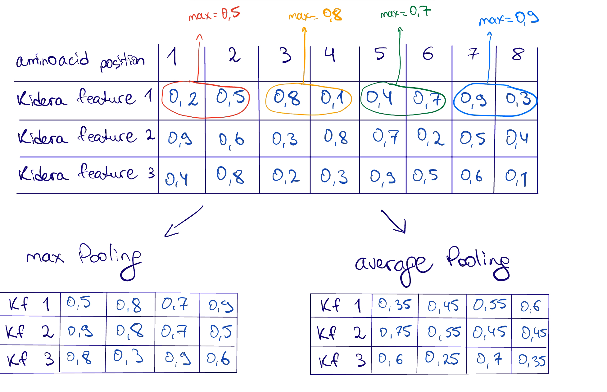
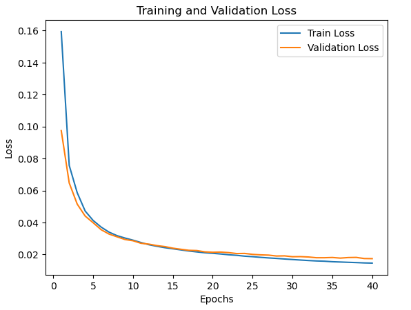
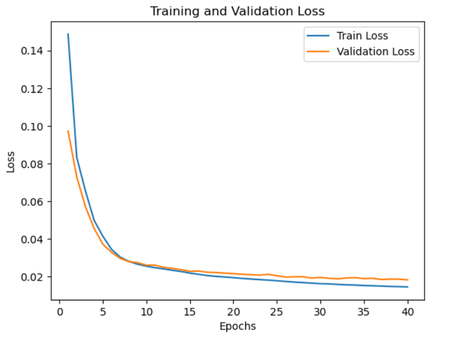

# Report for week 7 - Embedding using Convolutional Layers with Sigmoid activation function

Authors:

- Anna Beketova

- Shatu Ahmed

## Introduction

Previous weeks:

- CNN with Sigmoid activation function on the output layer
    
- High metrics --> precise model
    
- Fast performance
    
- Reduced dataset is much more agreeable with the model 

To Do:

- Try average pooling and compare with max pooling

- Measure training time of the approaches with best results

## Methods

### Pooling

#### Reminder: *What does input data for CNN look like?*

After embedding and padding each protein sequence is represented as a matrix where rows correspond to amino acids and columns correspond to Kidera factors.

This creates a 3D array of shape **(num_samples, num_features, sequence_length)**, which is then converted into a tensor, where:

- **num_features = 10** corresponds to the Kidera factors.

- **sequence_length** is the fixed sequence size (e.g., 1500).

- **num_samples** is the number of proteins in the dataset.

Each convolutional filter learns patterns from Kidera features across different amino acid positions.

#### *How does Pooling work in our case?*

Pooling in our case reduces the sequence length while preserving important features. Pooling is applied to the sequential Kidera embeddings to retain biologically relevant patterns.

- Max Pooling selects the most dominant feature in a window, preserving the strongest signal across amino acids.

- Average pooling computes the mean of the features in a window, smoothing variations but possibly losing key information.

#### *Example*

To perform average pooling, `AvgPool1d` function was used after each convolutional layer.

### Training time measurement

Training time was measured with `torch.cuda` functions.

The following experiments from previous weeks were chosen to be reproduced to measure training time:

|Experiment number|Sequence length|Epoch size|Optimizer|    Pooling|Learning rate|Weight decay|Precision|Recall|F1-score|   MCC|
|----------------:|--------------:|---------:|--------:|----------:|------------:|-----------:|--------:|-----:|-------:|-----:|
|                1|           1500|        40|     Adam|        Max|       0.0001|        None|   0.9806|0.9623|  0.9712|0.9704|
|                2|           2500|        40|      SGD|        Max|          0.1|        1e-4|   0.9691|0.9026|  0.9338|0.9334|
|                3|           4500|        40|     Adam|        Max|       0.0001|        None|   0.9796|0.9638|  0.9715|0.9707|
  

## Results & Discussion

- Adam optimizer

- Learning rate: 0.0001

- 40 epochs

### Average pooling

#### Sequence length: 1500

- Total training time: 17.20 minutes 

- Precision: 0.9591
- Recall: 0.9008
- F1 Score: 0.9280
- MCC: 0.9276

#### Sequence length: 3500

- Total training time: 30.27 minutes
- Presicion: 0.9477
- Recall: 0.9098
- F1 score: 0.9273
- MCC: 0.9263

### Max pooling ( experiment 1)

#### Sequence length: 1500

- Presicion: 0.9806
- Recall: 0.9623
- F1 score: 0.9712
- MCC: 0.9704

#### Sequence length: 4500 (experiment 3)

- Presicion: 0.9796
- Recall: 0.9638
- F1 score: 0.9715
- MCC: 0.9707

Both models generalise well and no overfitting is indicated. However the model with max pooling is more precise.

Proteins have functionally critical regions, and max pooling helps highlight these. It retains the strongest Kidera values at key positions, helping the CNN to detect functional domains or motifs more effectively.

Average Pooling smooths the values, which can make it harder to distinguish important functional differences between sequences. It may cause loss of biologically significant patterns, leading to worse classification performance.

### Training time measurements

|Experiment Num|Training time (minutes)|
|-------------:|----------------------:|
|           1  | 15.77                 |
|           2  | 29.56                 |
|           3  | 41.51                 |
|AvgPool, 1500 | 17.20                 |
|AvgPool, 3500 | 30.27                 |
